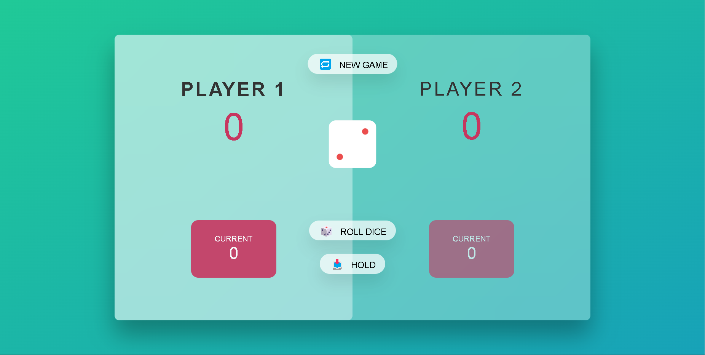
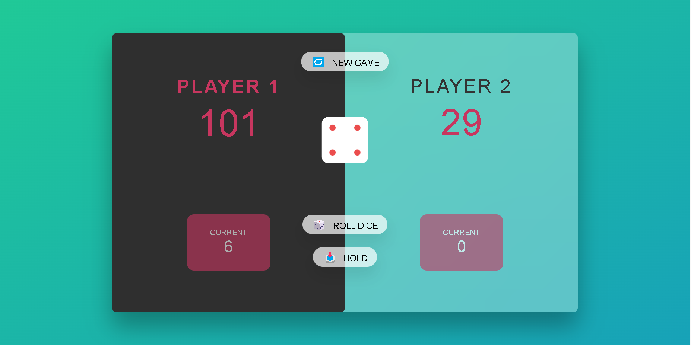

# The-Pig-Game
This is a Pig game made in JavaScript with an interactive UI  
# Rules:
- There are two Players
- Each time Dice is rolled, the score current is added to the previous score. 
- If you hold the score, the score will be saved to your total score (and turn will be changed) else it will not be counted to total score (till now)
- If Dice appears as 1 then the player is switched and all current scores will vanish if not held.
- When the Player's total Scores become equal to or greater than 100 then the player will win the game.

# Game Starting Screenshot

# Winning Game Screenshot

<strong>Player 1 won</strong>, click New Game button to restart the game

